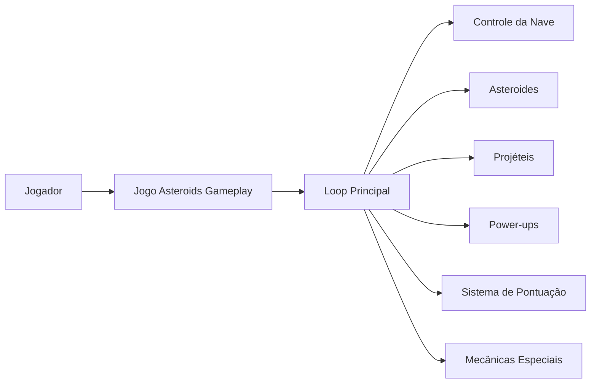

<h1 align="center">☄️ Asteroids Gameplay</h1>

<p align="center">
  
</p>

<p align="center">
  Projeto de evolução do jogo <strong>Asteroids</strong> em <strong>Pygame</strong>, com foco na criação e implementação de novas mecânicas de gameplay.<br>
</p>

---

<h2 align="center">📝 Descrição do Projeto</h2>

Este repositório tem como objetivo expandir o projeto-base **Asteroids em Pygame**, propondo melhorias de jogabilidade, novas mecânicas e organização do desenvolvimento em equipe.

O trabalho foi estruturado a partir de cinco frentes principais:

- **Proposição de 5 novas mecânicas** interessantes e divertidas para o jogo;
- **Documentação das mecânicas** em apresentação no Google Presentations;
- **Modelagem da solução** com apoio do **modelo C4**;
- **Divisão do desenvolvimento** entre os membros da equipe;

---

<h2 align="center">🎯 Objetivos da Atividade</h2>

- Evoluir o projeto original `asteroids_pygame`;
- Tornar a experiência do jogador mais dinâmica e divertida;
- Planejar as mudanças antes da implementação;
- Documentar tecnicamente a arquitetura e as decisões do grupo;

---

<h2 align="center">🕹️ Novas Mecânicas Propostas</h2>

As mecânicas abaixo representam a proposta de evolução do jogo.

### 1. Escudo Temporário
O jogador pode coletar um item especial que ativa um escudo por alguns segundos, protegendo a nave contra colisões ou disparos inimigos.

### 2. Combo de Destruição
Cada destruição consecutiva aumenta o multiplicador de pontos, incentivando decisões mais agressivas e maior precisão durante a partida.

---

<h2 align="center">🤖 Tecnologias Utilizadas</h2>

<p align="center">
  <a href="https://www.python.org"></a>
  <a href="https://www.pygame.org"></a>
  <a href="https://git-scm.com/"></a>
  <a href="https://github.com"></a>
  <a href="https://c4model.com/"></a>
</p>

---

<h2 align="center">📁 Estrutura do Projeto</h2>

```bash
📦 asteroids-gameplay
├── 📄 .gitignore
├── 📄 LICENSE
├── 📄 README.md
├── 📁 docs/
│   ├── 📁 diagrams/                    # diagramas C4
│   └── 📁 presentation/                # materiais do GDD / slides
└── 📁 src/
    ├── 📄 config.py                    # constantes e configurações do jogo
    ├── 📄 game.py                      # loop principal, cenas e interface
    ├── 📄 main.py                      # ponto de entrada do projeto
    ├── 📄 sprites.py                   # nave, asteroides, tiros, UFO e futuros power-ups
    ├── 📄 systems.py                   # regras do mundo, colisões, score e novas mecânicas
    └── 📄 utils.py                     # funções auxiliares
````

---

<h2 align="center">🧩 Modelagem com C4</h2>

O projeto utiliza o **modelo C4** para representar a solução em diferentes níveis de abstração, facilitando o entendimento da arquitetura e da responsabilidade de cada parte do sistema.

### Níveis utilizados

* **C1 – Contexto:** visão geral do sistema e sua relação com o jogador e ferramentas externas;
* **C2 – Contêineres:** visão dos principais blocos do projeto;
* **C3 – Componentes:** detalhamento interno dos módulos do jogo.

---

<h2 align="center">🧠 Visão Conceitual da Solução</h2>



---

<h2 align="center">🚀 Como Executar</h2>

### 1. Clonar o repositório

```bash
git clone https://github.com/JulianaBallin/asteroids-gameplay.git
cd asteroids-gameplay
```

### 2. Criar e ativar o ambiente virtual

```bash
python -m venv .venv
source .venv/bin/activate  # Linux/Mac
# .venv\Scripts\activate   # Windows
```

### 3. Instalar as dependências

```bash
pip install -r requirements.txt
```

### 4. Executar o jogo

```bash
python3 src/main.py
```

---

<h2 align="center">🎮 Funcionalidades Esperadas</h2>

| Funcionalidade            | Descrição                             |
| ------------------------- | ------------------------------------- |
| Movimentação da nave      | Controle da nave pelo jogador         |
| Disparo padrão            | Ataque básico do jogo                 |
| Asteroides                | Obstáculos principais da gameplay     |
| Power-ups                 | Itens especiais coletáveis            |
| Mecânicas adicionais      | Novos elementos propostos pela equipe |
| Sistema de pontuação      | Registro de desempenho do jogador     |
| Progressão de dificuldade | Aumento gradual do desafio            |

---

<h2 align="center">👥 Divisão da Equipe</h2>

| Integrante | Responsabilidade                  |
| ---------- | --------------------------------- |
| Juliana Ballin  | Escudo Temporário e Combo de Destruição|
| Membro 2   | Escrever aqui       |
| Membro 3   | Escrever aqui  |


---

<h2 align="center">📚 Referências</h2>

- **[Projeto base](https://github.com/jucimarjr/asteroids_pygame)**  
- **[C4 Model](https://c4model.com/)**  
- **[Documentação do Pygame](https://www.pygame.org/docs/)**  
- **[GDD produzido na Atividade 001](https://docs.google.com/presentation/d/1UXyp4I5FDXg9bF2bQBdwc88FN-VXUBg5lAF3YDhoxN4/edit?usp=drivesdk)**

---

<h2 align="center">👥 Equipe</h2>

| Nome         | Matrícula                   |
| ------------ | ------------------------ |
| Juliana Ballin Lima | 2315310011 |
| Escrever | Inserir |
| Escrever | Inserir |

---

<h3 align="center">UEA • Atividade 005 • Asteroids Gameplay</h3>

