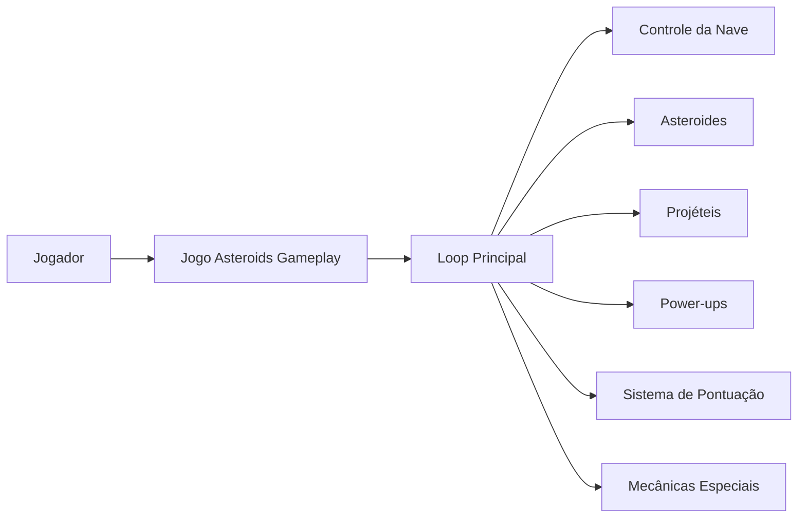

<h1 align="center">☄️ Asteroids Gameplay</h1>

<p align="center">
  
</p>

<p align="center">
  Projeto de evolução do jogo <strong>Asteroids</strong> em <strong>Pygame</strong>, com foco na criação e implementação de novas mecânicas de gameplay.<br>
  Desenvolvido para a <strong>Atividade 005 – Ajustes no Asteroids</strong>, da disciplina ministrada pelo professor <strong>Jucimar Maia da Silva Junior</strong>.
</p>

---

<h2 align="center">📝 Descrição do Projeto</h2>

Este repositório tem como objetivo expandir o projeto-base **Asteroids em Pygame**, propondo melhorias de jogabilidade, novas mecânicas e organização do desenvolvimento em equipe. A atividade envolve não apenas a implementação no código-fonte, mas também o planejamento conceitual das mecânicas, a documentação visual da solução e a divisão das responsabilidades entre os membros do grupo.

O trabalho foi estruturado a partir de cinco frentes principais:

- **proposição de 5 novas mecânicas** interessantes e divertidas para o jogo;
- **documentação das mecânicas** em apresentação no Google Presentations;
- **modelagem da solução** com apoio do **modelo C4**;
- **divisão do desenvolvimento** entre os membros da equipe;
- **rastreabilidade da contribuição individual**, por meio dos commits realizados por cada integrante.

---

<h2 align="center">🎯 Objetivos da Atividade</h2>

- Evoluir o projeto original `asteroids_pygame`;
- Tornar a experiência do jogador mais dinâmica e divertida;
- Planejar as mudanças antes da implementação;
- Documentar tecnicamente a arquitetura e as decisões do grupo;
- Organizar a colaboração da equipe de forma clara.

---

<h2 align="center">🕹️ Novas Mecânicas Propostas</h2>

As mecânicas abaixo representam a proposta de evolução do jogo. Os nomes e regras podem ser refinados durante o desenvolvimento.

### 1. Escudo Temporário
O jogador pode coletar um item especial que ativa um escudo por alguns segundos, protegendo a nave contra colisões ou disparos inimigos.

### 2. Tiro Especial Carregado
Além do disparo comum, a nave poderá utilizar um tiro especial com maior dano ou maior alcance, limitado por recarga ou energia.

### 3. Asteroides com Comportamentos Diferentes
Os asteroides passam a ter variações de comportamento, como maior velocidade, divisão em mais fragmentos ou mudança repentina de direção.

### 4. Sistema de Power-ups
Itens coletáveis surgem ao longo da partida, oferecendo bônus temporários como aumento de velocidade, disparo duplo ou recuperação.

### 5. Sistema de Pontuação com Multiplicador
O jogador poderá acumular multiplicadores ao destruir asteroides em sequência, recompensando reflexos e consistência durante a partida.

---

<h2 align="center">🤖 Tecnologias Utilizadas</h2>

<p align="center">
  <a href="https://www.python.org"></a>
  <a href="https://www.pygame.org"></a>
  <a href="https://git-scm.com/"></a>
  <a href="https://github.com"></a>
  <a href="https://c4model.com/"></a>
</p>

---

<h2 align="center">📁 Estrutura do Projeto</h2>

```bash
📦 asteroids-gameplay
├── 📄 main.py                # Ponto de entrada do jogo
├── 📄 README.md
├── 📄 requirements.txt       # Dependências do projeto
├── 📄 LICENSE
├── 📁 assets/                # Imagens, sons e recursos visuais
├── 📁 docs/
│   ├── 📁 diagrams/          # Diagramas C4
│   └── 📁 presentation/      # Materiais de apoio da atividade
├── 📁 src/                   # Lógica principal do jogo
│   ├── 📄 player.py
│   ├── 📄 asteroid.py
│   ├── 📄 bullet.py
│   ├── 📄 powerups.py
│   ├── 📄 score.py
│   └── 📄 mechanics.py
├── 📁 tests/                 # Testes do projeto, se aplicável
└── 📁 references/            # GDD, anotações e materiais auxiliares
````

> A estrutura acima pode ser ajustada de acordo com a organização final adotada pelo grupo.

---

<h2 align="center">🧩 Modelagem com C4</h2>

O projeto utiliza o **modelo C4** para representar a solução em diferentes níveis de abstração, facilitando o entendimento da arquitetura e da responsabilidade de cada parte do sistema.

### Níveis utilizados

* **C1 – Contexto:** visão geral do sistema e sua relação com o jogador e ferramentas externas;
* **C2 – Contêineres:** visão dos principais blocos do projeto;
* **C3 – Componentes:** detalhamento interno dos módulos do jogo.

---

<h2 align="center">🧠 Visão Conceitual da Solução</h2>



---

<h2 align="center">🚀 Como Executar</h2>

### 1. Clonar o repositório

```bash
git clone https://github.com/SEU-USUARIO/asteroids-gameplay.git
cd asteroids-gameplay
```

### 2. Criar e ativar o ambiente virtual

```bash
python -m venv .venv
source .venv/bin/activate  # Linux/Mac
# .venv\Scripts\activate   # Windows
```

### 3. Instalar as dependências

```bash
pip install -r requirements.txt
```

### 4. Executar o jogo

```bash
python main.py
```

---

<h2 align="center">🎮 Funcionalidades Esperadas</h2>

| Funcionalidade            | Descrição                             |
| ------------------------- | ------------------------------------- |
| Movimentação da nave      | Controle da nave pelo jogador         |
| Disparo padrão            | Ataque básico do jogo                 |
| Asteroides                | Obstáculos principais da gameplay     |
| Power-ups                 | Itens especiais coletáveis            |
| Mecânicas adicionais      | Novos elementos propostos pela equipe |
| Sistema de pontuação      | Registro de desempenho do jogador     |
| Progressão de dificuldade | Aumento gradual do desafio            |

---

<h2 align="center">👥 Divisão da Equipe</h2>

A atividade exige que o desenvolvimento seja dividido entre os membros do grupo. Cada integrante deverá atuar em partes específicas do projeto, como:

* implementação de mecânicas;
* ajustes visuais e de interface;
* documentação e apresentação;
* modelagem C4;
* testes e integração.

### Exemplo de divisão

| Integrante | Responsabilidade                  |
| ---------- | --------------------------------- |
| Membro 1   | Mecânicas de combate              |
| Membro 2   | Power-ups e itens especiais       |
| Membro 3   | Sistema de pontuação e progressão |
| Membro 4   | Documentação, C4 e apresentação   |

> Substitua essa tabela pelos nomes reais e pelas responsabilidades definidas pelo grupo.

---

<h2 align="center">🧾 Registro de Contribuições</h2>

Cada membro da equipe deve demonstrar sua participação por meio dos commits realizados no repositório.

Exemplo de boas práticas:

* criar branches por funcionalidade;
* utilizar mensagens de commit claras;
* manter histórico organizado;
* apresentar os commits individualmente na entrega.

### Exemplos de commits

```bash
feat: add temporary shield mechanic
feat: implement score multiplier system
docs: add C4 diagrams for gameplay architecture
refactor: reorganize asteroid collision logic
fix: correct player respawn behavior
```

---

<h2 align="center">📊 Documentação da Atividade</h2>

Além do código-fonte, o projeto deve conter ou referenciar:

* **GDD da Atividade 001** como base conceitual;
* **Google Presentations** com a descrição das novas mecânicas;
* **Diagramas C4** explicando a estrutura do projeto;
* **evidências da divisão do trabalho** entre os membros;
* **histórico de commits** individuais.

---

<h2 align="center">📚 Referências</h2>

* Projeto base: `asteroids_pygame`
* C4 Model
* Documentação do Pygame
* GDD produzido na Atividade 001
* Materiais e instruções da disciplina

---

<h2 align="center">👥 Equipe</h2>

| Nome         | Função                   |
| ------------ | ------------------------ |
| Inserir nome | Inserir responsabilidade |
| Inserir nome | Inserir responsabilidade |
| Inserir nome | Inserir responsabilidade |
| Inserir nome | Inserir responsabilidade |

---

<h3 align="center">UEA • Atividade 005 • Asteroids Gameplay</h3>

